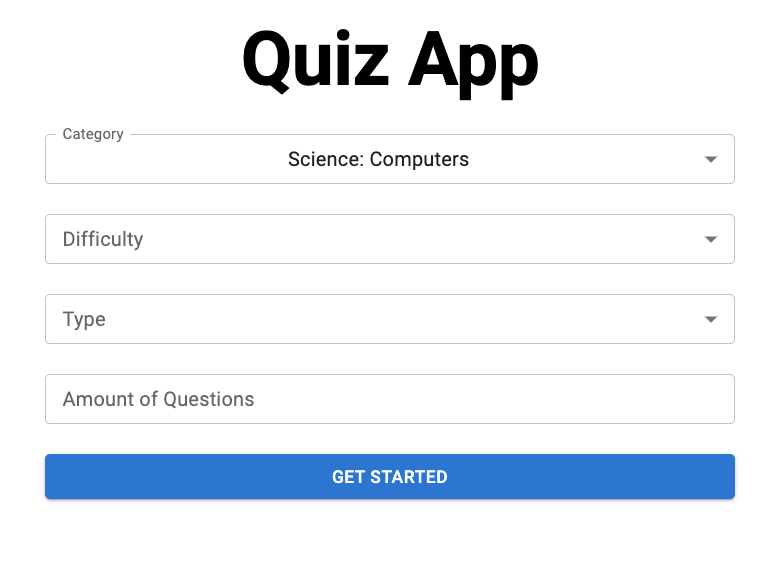

# BrainQuest: Modern Quiz Application

<div align="center">
  
  
  <h3 align="center">Test your knowledge with an interactive quiz experience</h3>
  
  <p align="center">
    <a href="#demo">View Demo</a>
    ·
    <a href="#about-the-project">About</a>
    ·
    <a href="#features">Features</a>
    ·
    <a href="#built-with">Tech Stack</a>
    ·
    <a href="#getting-started">Getting Started</a>
  </p>
</div>



## About The Project

BrainQuest is a modern, interactive quiz application built with React that allows users to test their knowledge across various categories. The app leverages the Open Trivia Database API to retrieve quiz questions dynamically, providing a seamless and engaging experience for users.

With sleek animations, responsive design, and an intuitive user interface, BrainQuest offers a fun way to learn and challenge yourself with quizzes on different topics and difficulty levels.

## Features

✨ **Dynamic Content**: Access thousands of questions from various categories through the Open Trivia Database API

🎨 **Modern UI/UX**: Enjoy a clean, responsive interface with smooth animations and transitions powered by Tailwind CSS and Framer Motion

🔍 **Customizable Quizzes**: Select specific categories, difficulty levels, and question types

📊 **Real-time Scoring**: Track your progress with an interactive scoring system

🎉 **Celebration Effects**: Experience confetti animations when achieving high scores

🌙 **Accessibility-Focused**: Designed with accessibility in mind for all users

## Built With

BrainQuest is built using modern web technologies:

- [React](https://reactjs.org/) - Front-end library
- [Redux](https://redux.js.org/) - State management
- [React Router](https://reactrouter.com/) - Navigation
- [Tailwind CSS](https://tailwindcss.com/) - Styling
- [Framer Motion](https://www.framer.com/motion/) - Animations
- [DaisyUI](https://daisyui.com/) - UI Components
- [Axios](https://axios-http.com/) - API requests

## Getting Started

Follow these simple steps to get a local copy up and running:

### Prerequisites

- Node.js (v16.0.0 or later)
- npm or yarn

### Installation

1. Clone the repository
   ```sh
   git clone https://github.com/your-username/brainquest-quiz-app.git
   cd brainquest-quiz-app
   ```

2. Install dependencies
   ```sh
   npm install
   # or
   yarn install
   ```

3. Start the development server
   ```sh
   npm start
   # or
   yarn start
   ```

4. Open [http://localhost:3000](http://localhost:3000) to view the app in your browser

## Usage

1. Select your preferred quiz category, difficulty, and question type
2. Choose the number of questions (between 1-50)
3. Click "Start Quiz" to begin
4. Answer the questions by clicking on the options
5. View your final score and statistics at the end
6. Retry the quiz or return to settings to configure a new one

## Project Structure

```
brainquest-quiz-app/
├── public/
│   ├── favicon.svg
│   ├── quiz-app.svg
│   └── index.html
├── src/
│   ├── components/
│   │   ├── SelectField.js
│   │   └── TextFieldComp.js
│   ├── hooks/
│   │   └── useAxios.js
│   ├── pages/
│   │   ├── FinalScreen.js
│   │   ├── Questions.js
│   │   └── Settings.js
│   ├── redux/
│   │   ├── actions.js
│   │   ├── actionsTypes.js
│   │   ├── reducer.js
│   │   └── store.js
│   ├── App.js
│   └── index.js
└── package.json
```

## API Reference

BrainQuest uses the Open Trivia Database API:

- Base URL: `https://opentdb.com/api.php`
- Documentation: [https://opentdb.com/](https://opentdb.com/)

## Contributing

Contributions are what make the open-source community such an amazing place to learn, inspire, and create. Any contributions you make are **greatly appreciated**.

1. Fork the Project
2. Create your Feature Branch (`git checkout -b feature/AmazingFeature`)
3. Commit your Changes (`git commit -m 'Add some AmazingFeature'`)
4. Push to the Branch (`git push origin feature/AmazingFeature`)
5. Open a Pull Request

## License

Distributed under the MIT License. See `LICENSE` for more information.

## Acknowledgments

- [Open Trivia Database](https://opentdb.com/) for providing the quiz API
- [html-entities](https://www.npmjs.com/package/html-entities) for encoding/decoding HTML entities
- [React Redux](https://react-redux.js.org/) for state management
- [React Router Dom](https://reactrouter.com/) for routing
- [Tailwind CSS](https://tailwindcss.com/) for styling

---

<p align="center">
  Made with ❤️ by <a href="https://github.com/your-username">Your Name</a>
</p>
